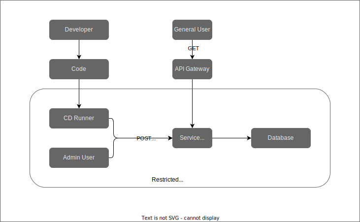

# Informational Service

This service is meant to provide information about the service as a whole.  Users who 
will ultimately consume the service will need to view information about the service to 
make determinations about how to use the service in their environment.  The types 
of information that should be exposed by the service are:

- Version information
- Policy information

### Administrative Access

Publishing specific information to the informational service should be done with 
administrative access only.  The ability to modify (e.g. `POST`, `PUT`, `DELETE`) parts 
of the service should be heavily controlled and not available for general user 
consumption.

Below is a high-level idea of how this service may be controlled.  The design is highly 
genericized to be portable to different technologies (e.g. on-prem versus public cloud)

